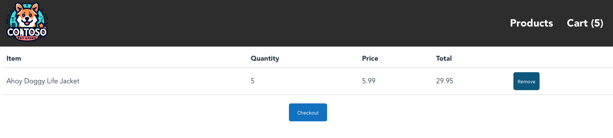

# 03. AKS 따라하기 - PaaS 서비스 사용

### 환경 변수 등록하기 (MAC OS 기준)

```java
export LOC_NAME=eastus
export RAND=$RANDOM
export RG_NAME=myResourceGroup
export AKS_NAME=myAKSCluster
export SB_NS=sb-store-demo-$RAND
```

## Azure Service Bus 네임 스페이스 및 큐 만들기

### Azure Service Bus란?

- 분리된 시스템 간에 데이터를 보낼 수 있도록 하는 비동기 메시지 클라우드 플랫폼
- 마이크로소프트에서 기본 제공하기에 추가적인 호스트의 필요성이 없음

### 네임 스페이스 만들기

```java
az servicebus namespace create --name $SB_NS --resource-group $RG_NAME --location $LOC_NAME
```

- 등록한 환경변수의 값을 토대로 서비스 버스 리소스의 주소를 지정하기 위한 컨테이너 제공

### 서비스 버스 큐 만들기

```java
az servicebus queue create --name orders --resource-group $RG_NAME --namespace-name $SB_NS
```

- 메세지가 저장되는 엔터티
- 분산된 여러 메세지를 해당 위치에서 받고 배포 센터와 비슷
- 사용되는 프로토콜
    
    *• AMQP(고급 메시지 큐 프로토콜) 1.0
    • TLS를 사용하는 HTTPS(Hypertext Transfer Protocol) 1.1*
    

**권한 부여 프로토콜**

```java
az servicebus queue authorization-rule create --name sender --namespace-name $SB_NS --resource-group $RG_NAME --queue-name orders --rights Send
```

**서비스 버스 자격증명**

```java
az servicebus namespace show --name $SB_NS --resource-group $RG_NAME --query name -o tsv
az servicebus queue authorization-rule keys list --namespace-name $SB_NS --resource-group $RG_NAME --queue-name orders --name sender --query primaryKey -o tsv
```

- 첫번째 나오는 값이 HOSTNAME 이고 두번째 나오는 값이 PASSWORD이다.
- 이를 토대로 아래의 `yaml` 파일을 수정

```java
apiVersion: apps/v1
kind: Deployment
metadata:
  name: order-service
spec:
  replicas: 1
  selector:
    matchLabels:
      app: order-service
  template:
    metadata:
      labels:
        app: order-service
    spec:
      nodeSelector:
        "kubernetes.io/os": linux
      containers:
      - name: order-service
        image: <REPLACE_WITH_YOUR_ACR_NAME>.azurecr.io/aks-store-demo/order-service:latest
        ports:
        - containerPort: 3000
        env:
        - name: ORDER_QUEUE_HOSTNAME
          value: "<REPLACE_WITH_YOUR_SB_NS_HOSTNAME>" # Example: sb-store-demo-123456.servicebus.windows.net
        - name: ORDER_QUEUE_PORT
          value: "5671"
        - name: ORDER_QUEUE_TRANSPORT
          value: "tls"
        - name: ORDER_QUEUE_USERNAME
          value: "sender"
        - name: ORDER_QUEUE_PASSWORD
          value: "<REPLACE_WITH_YOUR_SB_SENDER_PASSWORD>"
        - name: ORDER_QUEUE_NAME
          value: "orders"
        - name: FASTIFY_ADDRESS
          value: "0.0.0.0"
        resources:
          requests:
            cpu: 1m
            memory: 50Mi
          limits:
            cpu: 75m
            memory: 128Mi
```

### 설정이 끝나면 재 배포

- `kubectl apply -f aks-store-quickstart.yaml` 를 실행해 배포한다.
- `kubectl get service store-front` 를 활용해 IP를 통해 접속한다.
    
    
    
- *구매* 버튼을 누른다.

### Azure Portal의 서비스 버스에서 확인

1. Azure Portal로 이동하여 이전에 만든 Azure Service Bus 네임스페이스를 열기
2. **엔터티**에서 **큐**를 선택한 다음 **주문** 창을 선택
3. **주문** 큐에서 **Service Bus Explorer**를 선택
4. **Peek from Start**을 선택하여 제출한 주문을 확인

```java
{"customerId":"1554073213","items":[
{"productId":10,"quantity":5,"price":5.99}
]}
```