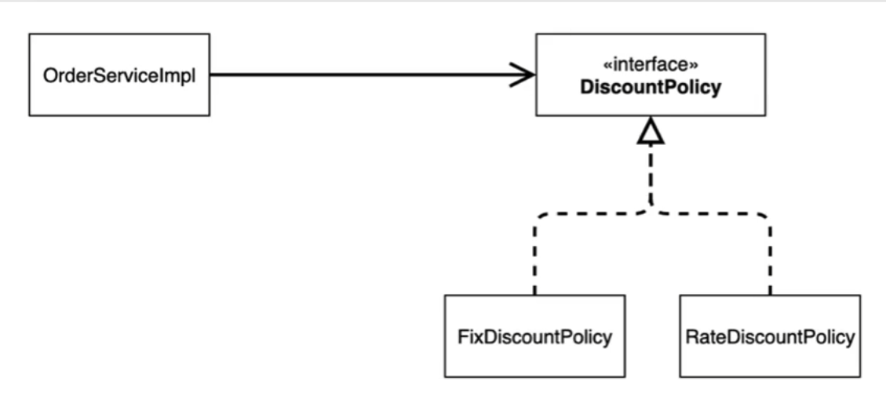

# 스프링과 객체 지향 원칙

```jsx
public class OrderServiceImpl implements OrderService{

    private final MemberRepository memberRepository = new MemberRepositoryImpl();
    //private final DiscountPolicy discountPolicy = new FixDiscountPolicy();
    private  final DiscountPolicy discountPolicy = new RateDiscoutPolicy();
```

이 코드는 과연 옳게 된 코드일까?

### DIP

- 주문 서비스 클라이언트 인터페이스에 의존하면서 DIP를 지킨것 같아 보이지만…
    
    **→ 구체 클래스에도 의존하고 있다. `Fix` , `Rate`**
    
- OCP → 변경하지 않고 확장할 수 있다.
    - 하지만 이 코드는 여전히 변경하지 않고는 확장 할 수가 없다

### 기대한 의존 관계



### 실제 의존 관계


- 실제로는 할인 기능은 `OrderServiceImpl` 에게도 의존 하고 있다.
- 즉 할인 정책의 변경이 `OrderServiceImpl` 의 코드도 변경해야한다.

### 결론

> 이 코드는 현재 **OCP** 위반 코드이다.
> 

### 이걸 어떻게 바꾸지?

```jsx
public class OrderServiceImpl implements OrderService{

    private final MemberRepository memberRepository = new MemberRepositoryImpl();
    private DiscountPolicy discountPolicy;
```

- Impl에 의존하지 않은 코드!
- **NullPointException!**

## 해결방안

- 누군가가 `OrderServiceImpl` 에 `DiscountPolicy` 에 주입해줘야한다.
- 즉 구현 클래스는 구현만 주입 클래스는 주입만의 **관심사 분리**가 필요한 순간