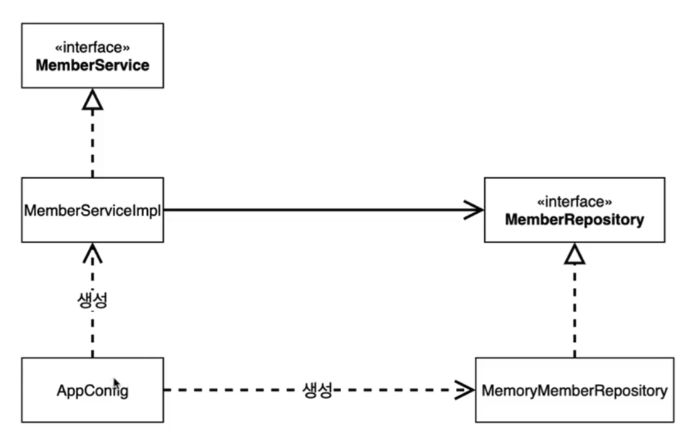

# AppConfig

> 애플리케이션의 전체 동작 방식을 구성하기 위해, **구현 객체 생성** 하고 **연결** 하는 책임을 가지는 별도의 설정 클래스
> 

```jsx
	private final MemberRepository memberRepository = new MemberRepoistryImpl();
```

- 위의 코드를 아래와 같이 바꾼다.

```jsx
public class MemberServiceImpl implements MemberService{

	private final MemberRepository memberRepository;

	public MemberServiceImpl(MemberRepository memberRepository) {
		this.memberRepository = memberRepository;
	}
```

- 기존의 OrderService도 바꿔준다.

```jsx
    private final MemberRepository memberRepository;
    private final DiscountPolicy discountPolicy;

    public OrderServiceImpl(MemberRepository memberRepository, DiscountPolicy discountPolicy) {
        this.memberRepository = memberRepository;
        this.discountPolicy = discountPolicy;
    }
```

### 새로 만든 AppConfig.java

```jsx
/**
 * 객체를 생성하고 주입해주는 역할을 해주는 클래스
 */
public class AppConfig {

    //생성자 주입
    public MemberService memberService() {
        return new MemberServiceImpl(new MemberRepositoryImpl());
    }

    //생성자 주입
    public OrderService odOrderService() {
        return new OrderServiceImpl(new MemberRepositoryImpl(), new FixDiscountPolicy());
    }
}
```

- 기존의 저장소와 서비스 객체는 생성자를 스스로 생성하지 않기에 어떤 저장소가 들어갈지 어떤 서비스가 들어갈지는 모른다! 즉 **자유**
- `MemberServiceImpl` 는 이제 어떤 생성자를 통해 어떤 객체가 들어올지 알 수 없다.
- `MemberServiceImpl` 는 이제부터 의존 관계에 대한 고민은 외부에 맡기고 실행에만 집중한다!

### 확장된 AppConfig를 감안한 클래스 다이어그램



- 객체의 생성과 연결은 `AppConfig` 가 담당한다.
- **DIP 완성**

## 개선할점?

- 현재 AppConfig는 **중복**이 있다**.**