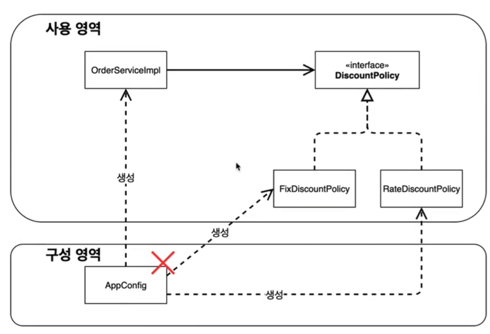

# 스프링과 객체 지향 설계 원칙(2)

- AppConfig의 등장으로 애플리케이션이 크게 사용영역과 구성 영역으로 분리

- 사용 영역의 개발틀은 변경시에 전혀 손댈 필요가 없다!

### 우리는 어떤 객체지향 설계를 완성했는가?

- **단일 책임 원칙**
    - 기존의 코드는 객체를 생성하고 연결하는 등 다양한 책임
    - 관심사 분리로 이걸 달성 (AppConfig)
- **의존 관계 역전 원칙**
    - 구체화의 의존하는 코드
    - `OrderServiceImpl` 라는 구체화에 의존하는 할인률을 제거
    - `AppConfig` 가 이것을 대신해서 객체를 주입해주면서 DIP를 만족
- **OCP**
    - AppConfig를 활용해서 클라이언트 코드에 주입
    - 클라이언트 코드는 변경할 필요가 없다.
    - 확장에는 열려있고 변경에는 닫혀있다.
    

## 정리 : IoC, DI 그리고 컨테이너

### IoC (제어의 역전)

- 기존 프로그램은 클라이언트의 구현객체가 스스로 서버 구현 객체 생성 및 연결 실행까지 수행
- AppConfig의 등장으로 객체는 로직 실행만의 역전
- 제어의 흐름은 AppConfig가 가져간다.
- 이렇듯 프로그램의 제어 흐름을 외부에서 관리하는 것을 → **IoC(제어의 역전)** 이라고 한다.

### ID (의존 관계 주입)

- 의존 관계는 **정적 클래스 의존 관계**, **동적 객체 의존관계** 로 분리해서 생각
- **정적 클래스 의존 관계**
    - import나 코드를를 실행하지 않고 알 수 있는 의존 관계
    - 위의 코드에선 정적 클래스 의존 관계를 통해 어떤 클래스가 어떤 클래스에 주입 될 지는 알 수 가 없다.
- **동적 클래스 의존 관계**
    - 어플리케이션 실행 시점에 연결된 의존 관계
    - 실행시점에 연결 되는것 → 의존 관계 주입
    - 정적인 클래스의 의존관계를 변경하지 않고, 동적인 객체 인스턴스 관계를 쉽게 변경이 가능하다.

## IoC 컨테이너, DI 컨테이너

- Appconfig 처럼 객체 생성 관리 의존관계 연결해주는 것을 IoC 컨테이너, DI 컨테이너라고 한다.
- 의존 관계에 초첨을 맞추면 → **DI 컨테이너**
- 어셈블러라고도 불린다.

### *추가 : 프레임 워크 vs 라이브러리*

- **프레임 워크**
    - 내가 작성한 코드를 제어하고 대신 실행한다.
    - 자신만의 라이프사이클이 존재함
    - JUnit, Spring
- **라이브러리**
    - 내가 작성한 코드의 흐름을 내가 제어한다.