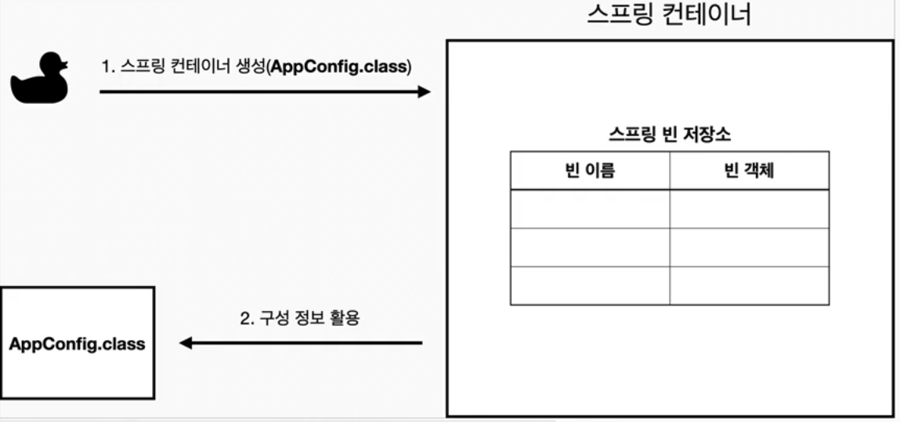

# 스프링 컨테이너와 빈

## 스프링 컨테이너

### 어떻게 컨테이너는 생성되는가?

> `ApplicationContext ac = new AnnotationConfigApplicationContext (AppConfig.class);`
> 
- `**ApplicationContext**`
    - 스프링 컨테이너
    - 인터페이스
    - XML 기반으로 만들거나, 어노테이션 기반으로 만든다.
    - AppConfig를 사용한 방식이 어노테이션 기반 스프링 컨테이너

### 내부적으로는?



- `new AnnotationConfigApplicationContext(AppConfig.class)`
- `AppConfig.class` 를 구성정보로 저장하면서 스프링 컨테이너를 생성한다.


- 각 메서드마다 이름을 붙이며 빈 객체를 등록한다.
- 이름은 기왕이면 메서드 이름과 통일한다.


- 스프링 빈 의존 관계 설정을 한다
- 이건 설정 정보를 참고해서 의존관계를 주입한다.

### 빈이 잘 등록되었는지 확인하기 (빈 조회)

```jsx
   @Test
    @DisplayName("에플리케이션 빈 출력")
    void findApplicationAllBean() {
        String[] beanDefinitionNames = ac.getBeanDefinitionNames();

        for (String beanDefinitionName : beanDefinitionNames) {
            BeanDefinition beanDefinition = ac.getBeanDefinition(beanDefinitionName);

            // 내가 등록한 빈만 출력
            if (beanDefinition.getRole() == BeanDefinition.ROLE_APPLICATION) {
                Object object = ac.getBean(beanDefinitionName);
                System.out.println("name = " + ac.getBean(beanDefinitionName) + " | Object = " + object);
            }
        }
    }
```

- 내가 등록한 빈들을 볼 수 있다.
- 빈 이름, 빈 타입 등으로 조회가 가능하다.
- 부모 객체를 조회시 하위 타입 빈들이 모두 조회된다.
    - 즉 특정 하위타입 빈으로 조회하거나
    - 하위 타입 중 이름으로 조회하여야한다.

## BeanFactory와 ApplicationContext


### BeanFactory

- 스프링 컨테이너의 최상위 인터페이스
- 스프링 빈을 관리 및 조회
- `getBean()` 제공
- 지금까지 배운 대부분의 기능은 BeanFactory가 제공하는 기능

### ApplicationContext

- `BeanFactory` 기능을 상속받아서 제공
- 빈을 관리하고 검색하는 기능을 하는 **BeanFactory**와의 차이는?
- 빈 관리를 넘어 다른 부가 기능을 제공
    - 일반적인 Web에서는 더 많은 기능이 필요하다.
    - 이걸 다양하게 관리하기 위해서 필요한 기능이다.


### 기능

- 국제화 기능 (영어 → 한국어)
- 환경 변수 (로컬, 개발, 운영 등을 구분해서 처리)
- 애플리케이션 이벤트 (이벤트 발행 및 구독 모델 편리 지원)
- 편리한 리소스 조회 (파일이나 클래스를 외부에서 조회)

### 정리

- **ApplicationContext**는 BeanFactory의 기능을 상속 받는다.
- **ApplicationContext**는 빈 관리 기능 + 편리한 부가 기능을 제공한다.
- 주로 사용되는 것 역시 **ApplicationContext**이다.
- **ApplicationContext나 BeanFactory**를 스프링 컨테이너라고 한다. ****