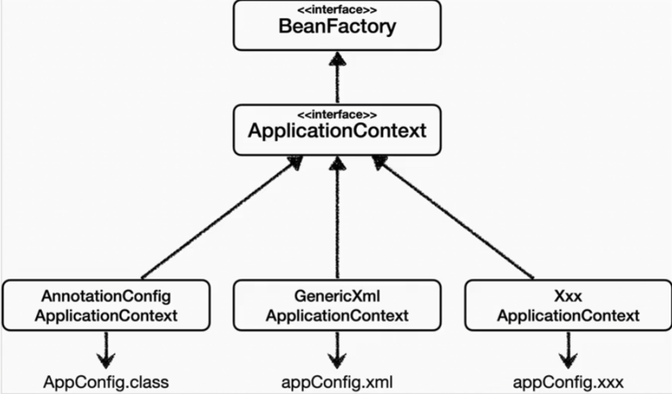

# 스프링 설정

> 스프링 컨테이너는 다양한 형식의 설정 정보를 받아 드릴 수 있도록 유연하게 설계되어 있다.
> 



### 어노테이션 기반 자바 코드 설정 사용

- 지금까지 한것
- `new AnnotaionConfigApplicationContext(AppConfig.class)`
- 자바 코드로 된 설정 정보

### XML 설정 사용

- 스프링 부트의 사용으로 인해 설정을 사용하지 않지만… 레거시 프로젝트들인해 XML로 아직 설정하기도 한다.
- 컴파일 없이 빈 정보를 바꿀 수 있다.
- `ApplicaionContxt.xml` 을 사용한다.

```jsx
<beans xmlns="http://www.springframework.org/schema/beans"
       xmlns:xsi="http://www.w3.org/2001/XMLSchema-instance"
       xsi:schemaLocation="http://www.springframework.org/schema/beans http://www.springframework.org/schema/beans/spring-beans.xsd">

    <bean id = "memberService" class = "member.MemberServiceImpl">
        <constructor-arg name = "memberRepository" ref = "memberRepository" />
    </bean>

    <bean id = "memberRepository" class="member.MemberRepositoryImpl"/>
    <bean id = "discountPolicy" class="hello.core.discount.RateDiscoutPolicy"/>

    <bean id = "orderService" class="hello.core.order.OrderServiceImpl">
        <constructor-arg name="memberRepository" ref = "memberRepository"/>
        <constructor-arg name="discountPolicy" ref ="discountPolicy" />
    </bean>

    </beans>
```

- xml 기반에서 주로 사용됨
- 싸피에서 배운 내용

## BeanDefinition

> 스프링은 어떻게 이렇게 유연하게 설계가 가능할까? → **스프링 빈 설정 추상화**
> 

- **역할과 구현을 개념적으로 나눈 것**
- XML을 읽어 BeanDefinition 만든다.
- 자바 코드를 읽어 BeanDefinition 만든다.
- 스프링은 오직 BeanDefinition만 알면 된다.
- BeanDefinition을 빈 설정 메타정보라 한다.
    - `@Bean` , `<Bean>`


**코드 level**


- 뭘로 하던 읽어낸다!