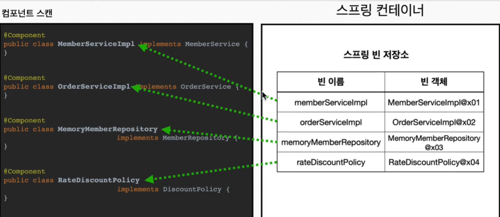

# 컴포넌트 스캔와 의존관계 자동 주입

- 스프링 빈은 @Bean이나 xml을 통해 생성하였다.
- 하지만 Bean이 엄청 많아진다면…?
- 스프링 내에는 설정 정보 없이도 자동으로 스프링 빈은 등록하는 컴포넌트 스캔이라는 기능을 제공
- 의존관계까지 자동으로 주입하는 `@AutoWired` 라는 기능도 제공한다.

> 일반적인 컴포넌트 스캔은 모든 `@Configuration` 이 붙은 설정도 자동 등록이 되기에 필터를 활용해 제외할 것을 적어준다. *(`@Configuraion` 안에 `@Component` 가 존재한다…)*
> 

```java
AutoAppConfig.java

@Configuration
@ComponentScan ( excludeFilters @ ComponentScan.Filter(type = FilterType.ANNOTATION, classes = Configuraion.class))
)
public class AutoAppConfig {
			
}

```

- `@ConmponentScan` : 모든 `@Component` 어노테이션이 붙은 클래스를 스캔에 스프링 빈에 등록한다.
- 그렇다면 의존관계의 주입은?
    - `@Autowired` 를 사용해서 의존관계를 주입한다!
    
    ```jsx
    @Component
    public class MemberServiceImpl implements MemberService{
    
    	private final MemberRepository memberRepository;
    
    	@Autowired
    	public MemberServiceImpl(MemberRepository memberRepository) {
    		this.memberRepository = memberRepository;
    	}
    ```
    
    - 자동으로 `@Compoent` 를 찾아서 `@Autowored` 를 통해 의존관계 자동으로 주입한다.
    - 단 주입받는 객체 또한 `@Component` 여야한다.

### 어떻게 컴포넌트 스캔과 자동 주입이 이뤄지는가?



- `@Component` 가 붙은 모든 클래스를 스프링 빈으로 등록한다.
- 빈의 기본 이름은 클래스명과 동일하지만 앞글자를 소문자로 사용한다.
    - `MemberServiceImpl` → `memberServiceImpl`
    - 임의의로 지정하고 싶으면 `@Component( )` 로 한다.

### AutoWired는 어떻게 이뤄지는건가?


- 생성자에 `@Autowired` 를 지정하면 컨테이너가 알아서 빈을 주입한다.
- 기본적으론 타입이 같은 빈을 찾아서 주입
    - `getBean(클래스이름.class)` 와 같다.
- 생성자 파라미터가 많아도 알아서 전부 bean 찾아서 주입해준다.

## 탐색 위치와 기본 스캔 대상

- 모든 클래스를 탐색하기엔 조금 시작이 된다.
    
    ```jsx
     import "내패키지경로.디폴트경로이다."
      
      basePackages = "hello.core.탐색할패키지경로"
    ```
    
    - 이외의 패키지는 스캔 하지 않는다.
    - 오직 저기부터 하위만 한다.
    - 만약 지정하지 않으면 스캔 하는 패키지의 하위부터 시작한다.

> 일반적으로 패키지 위치를 지정하지 않고 시작 루트에 *AppConfig* 같은 메인 설정 정보를 두고 `@ComponentScan` 어노테이션을 통해 지정을 생략한다.
> 

### 컴포넌트 스캔 대상

단순히 `@Component` 만 사용하지 않고 다양한 어노테이션으로 사용이 가능한다.

- `@Component` : 컴포넌트 스캔
- `@Service` : 컨트롤러
    - 딱히 뭘 하진 않지만 개발자가 인지용
- `@Controller` : 비즈니스 로직
    - MVC의 컨트롤러로 인식
- `@Repository` : 데이터 접근 계층
    - 스프링 데이터 접근 계층으로 인식, 데이터 계층의 예외를 스프링 예외로 변환
- `@Configuration` : 스프링 설정 정보
    - 스프링 설정보로 인식, 싱글톤 유지를 위한 추가 처리

> ***참고** : 어노테이션에는 상속관계가 없다. 즉 이건 Java의 지원 기능이 아닌 스프링이 지원하는 것이다.*
> 

## 컴포넌트 충돌

- 컴포넌트 스캔에 있어 같은 이름의 빈이 충돌난다면?

### `@Component(name = "수동이름 지정")` 로 같은 이름

- 당연하게 충돌 난다…

### `@Component(name = "수동이름 지정")` vs `@Component`

- 후자가 자동이라면?
- 수동으로 이름 지은게 자동 이름과 같다면?
- **충돌이 일어나지 않는다..?**
    - **수동 빈이 우선권을 가지고 오버라이딩 한다.**

> *이러한 결과는 추후 잡기 힘든 버그를 유발한다…*
> 

- 그렇기에 수동 빈등록 vs 자동 빈등록 이슈가 발생시 스프링 부트가 에러를 생성해준다
- 언제나 어설픈 추상화는 사용하지 않은게 좋다.