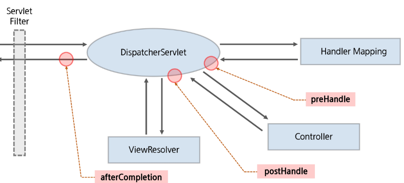

# File Upload & Interceptors

### Multipart

- form에서 입력하는 문자열 data
    - 이건 문자열(String)일까?
    - 아니면 파일(File)일까?
- 서버는 이를 언제나 분간해야한다.

## File Upload

- `web.xml` 에 **multipartResolver**로 등록해야한다.
- 추가적으로  mulitipart-config도 설정해줘야한다.
- `BoardController.java`
    
    ```jsx
    	@PostMapping("/write")
    	public String write(@ModelAttribute("boardDto") BoardDto boardDto,
    			@RequestParam(value = "upfile", required = false) MultipartFile[] files, HttpSession session,
    			RedirectAttributes redirectAttributes) throws Exception {
    		logger.debug("write boardDto : {}", boardDto);
    		MemberDto memberDto = (MemberDto) session.getAttribute("userinfo");
    		boardDto.setUserId(memberDto.getUserId());
    
    //		FileUpload 관련 설정.
    		logger.debug("MultipartFile.isEmpty : {}", files[0].isEmpty());
    		if (!files[0].isEmpty()) {
    			String realPath = servletContext.getRealPath("/upload");
    //			String realPath = servletContext.getRealPath("/resources/img");
    			String today = new SimpleDateFormat("yyMMdd").format(new Date());
    			String saveFolder = realPath + File.separator + today;
    			logger.debug("저장 폴더 : {}", saveFolder);
    			File folder = new File(saveFolder);
    			if (!folder.exists())
    				folder.mkdirs();
    			
    			List<FileInfoDto> fileInfos = new ArrayList<FileInfoDto>();
    			for (MultipartFile mfile : files) {
    				FileInfoDto fileInfoDto = new FileInfoDto();
    				String originalFileName = mfile.getOriginalFilename();
    				if (!originalFileName.isEmpty()) {
    					String saveFileName = UUID.randomUUID().toString()
    							+ originalFileName.substring(originalFileName.lastIndexOf('.'));
    					fileInfoDto.setSaveFolder(today);
    					fileInfoDto.setOriginalFile(originalFileName);
    					fileInfoDto.setSaveFile(saveFileName);
    					logger.debug("원본 파일 이름 : {}, 실제 저장 파일 이름 : {}", mfile.getOriginalFilename(), saveFileName);
    					mfile.transferTo(new File(folder, saveFileName));
    				}
    				fileInfos.add(fileInfoDto);
    			}
    			boardDto.setFileInfos(fileInfos);
    		}
    
    		boardService.writeArticle(boardDto);
    		redirectAttributes.addAttribute("pgno", "1");
    		redirectAttributes.addAttribute("key", "");
    		redirectAttributes.addAttribute("word", "");
    		return "redirect:/article/list";
    	}
    ```
    

## Interceptor

- Controller가 요청을 처리하기 전/후 처리
- 공통 코드 사용으로 코드의 재사용성 증가
- 비즈니스 로직과는 분리되는 기능을 넣고 싶을 때 유용
- 여러개 설정 가능
- 사용 예
    - Session 검증
    - Header 검증
- mehod 실행 시점
    
    
    
    **HandlerInterceptor 제공**
    

## Interceptors 설정

- `**Servlet-context.xml**`
    
    ```jsx
    	<beans:bean id="confirm" class="com.ssafy.interceptor.ConfirmInterceptor"/>
    
    	<interceptors>
    		<interceptor>
    		
    			<!-- <mapping path="/article/*"/> -->
    			<mapping path="/article/write"/>
    			<mapping path="/article/view"/>
    			<mapping path="/article/modify"/>
    			<mapping path="/article/delete"/>
    			<!-- <exclude-mapping path="/user/log*"/> -->
    			
    			<!-- <beans:bean class="com.ssafy.interceptor.ConfirmInterceptor"/> -->
    			<beans:ref bean="confirm"/>
    		</interceptor>
    	</interceptors>
    ```
    

**AoP vs Interceptor**

- AoP는 모든 범위 (서비스나 다른 것들)
- Interceptor는 메서드(Controller) 기준
- Filter와도 비슷하다.

### Filter vs Interceptor vs AoP

