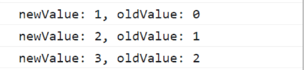

# Vue의 문법

## Text Interpolation

```jsx
<p>Message: {{ msg }}</p>
```

- 데이터 바인딩의 기본적인 형태
- 이중 중괄호 구문
- msg 속성 변경시 업데이트
- 이걸 출력하기 위해서는 `v-html` 사용 필요

```jsx
<div v-html="rawHtml"></div>;
const rawHtml = ref('<span style="color:red">This should be red.</span>');
```

## Directive

> ‘v-’ 접두사가 있는 특수 속성

- Directive의 속성 값을 단일 JS 표현식
- 값 변경시 DOM에 반응적 업데이트 적용

### 조건에 따른 <p> 구문 출력

```jsx
<p v-if="seen"> Hi there</p>
```

### D - Arguments

- 일부 directive는 뒤에 콜론 표시 인자를 사용 가능

```jsx
<a :href="myUrl">Move to url</a>
<p :[dynamicattr]="dynamicValue">Dynamic Attr</p>
<button :disabled="isOk" @click="pushOk">확인</button>
```

- `.` 은 특수 접미사로 directive가 특별한 방식으로 바인딩 되어야함을 나타냄
  `<form @submit.prevent ="onSubmit"> ... </form>`

## Dynamically data binding

### v-bind

> 하나 이상의 속성 또는 컴포넌트 데이터를 표현식에 동적 바인딩

```jsx

```

- 객체를 class에 전달하여 클래스의 동적 전환

```jsx
const isAcive = ref(false)
<div :class = "{ active : isActive}">Text</div>
```

_그 외 다양한 방식 지원…_

## Event Handling

### v-on

```jsx
v-on:event = "handler"
```

- 핸들러의 종류
  - Inline handlers : 이벤트 트리거 실행 될 JavaScript 코드
  - Method handlers : 컴포넌트에 정의된 메서드 이름
  - 약어 `@` 로도 사용이 가능

## Computed()

- 계산된 속성을 정의하는 함수
- 미리 계산된 속성을 사용하여 표현식의 단순화와 불필요한 반복 연산을 줄인다.
- 반복되는 값은 ref이다.
  ```jsx
  const restOfTodos = computed(() => {
    console.log("computed Call!");
    return todos.value.length > 0 ? "아직 남았다" : "퇴근!";
  });
  ```
- computed 속성은 의존된 반응형 데이터를 자동 추적
- 의존 데이터 변경 될 때 재평가
  - restOfTodos의 계산은 todos에 의존
  - todos가 바꿀때만 업데이트

### computed와 method의 차이

- computed 속성은 의존형 반응형 데이터 기반 cache
- _conputed_ 는 의존 데이터 변경시에만 재평가
- *method*은 렌더링이 발생할 때마다 항상 함수를 실행
- 서로 조합하며 사용하자

## Conditional, List

### v-if

- 조건문임

```jsx
 <!-- if else -->
      <p v-if="isSeen">true일때 보여요</p>
      <p v-else>false일때 보여요</p>
      <button @click="isSeen = !isSeen">토글</button>

      <!-- else if -->
      <div v-if="name === 'Alice'">Alice입니다</div>
      <div v-else-if="name === 'Bella'">Bella입니다</div>
      <div v-else-if="name === 'Cathy'">Cathy입니다</div>
      <div v-else>아무도 아닙니다.</div>
```

- 일반적으로 diretive이기에 **template** 요소에 적용해 여러 요소에 적용 가능
  ```jsx
  <!-- v-if on <template> -->
  <template v-if="name === 'Cathy'">
    <div>Cathy입니다</div>
    <div>나이는 30살입니다</div>
  </template>
  ```
  - _template란? : JS를 위한 보이지 않은 wrapper_
- **v-show** 와는 뭐가 다르지?
  - v-show는 항상 렌더링 되어 DOM에 남아있음
  - css display 속성 전환으로 핸들링 됨
  - 상대적으로 if에 비해 토글 비용이 낮다.
- v-if는 false의 경우 아무 작업도 수행하지 않는다.

### v-for

> 소스 데이터 기반 요소 템플릿 여러번 렌더링

```jsx
<div v-for="(item, index) in myArr">
	{{ index }} / {{ item.name }}
</div>
```

- 배열 반복

  ```jsx
  const myArr = ref([
              { name: "Alice", age: 20 },
              { name: "Bella", age: 21 },
  ]);

  <ul>
    <template v-for="item in myArr">
      <li>{{ item.name }}</li>
      <li>{{ item.age }}</li>
      <hr />
    </template>
  </ul>
  ```

- 객체 반복

  ```jsx
  const myObj = ref({
    name: "Cathy",
    age: 30,
  });

  <div v-for="(value, key, index) in myObj">
    {{ index }} / {{ key }} / {{ value }}
  </div>;
  ```

- template을 활용한 v-for
  ```jsx
  <!-- v-for on <template> -->
  <ul>
  	<template v-for="item in myArr">
  	<li>{{ item.name }}</li>
  	<li>{{ item.age }}</li>
  	<hr />
  	</template>
  </ul>
  ```
- 상위객체에 대한 접근이 가능한 중첩 for문도 가능하다.
- 반드시 v-for와 key를 함께 사용한다.

  ```jsx
  const items = ref([
  	{ id: id++, name: "Alice" },
  	{ id: id++, name: "Bella" },
  ]);

  <div v-for="item in items" :key="item.id">
  	{{item.id}} - {{item.name}}
  </div>
  ```

- 동일 요소에 v-for와 v-if를 함께 사용하지 않는다.
  - 우선순위는 v-if > v-for이다.
  - 즉 v-for의 todo 요소를 v-if에 적용 불가
  ```jsx
  <li v-for="todo in todos" v-if="!todo.isComplete" :key="todo.id">
  	{{ todo.name }}
  </li>
  ```

### 해결법

- 반복과 조건을 함께 할때는 **computed**를 활용 할 수 있다.

  ```jsx
  const completeTodos = computed(() => {
  		return todos.value.filter((todo) => !todo.isComplete);
  });

  <li v-for="todo in completeTodos" :key="todo.id">
  		{{ todo.name }}
  </li>
  ```

- v-for와 template 요소를 사용하여 **v-if를 이동**
  ```jsx
  <template v-for="todo in todos" :key="todo.id">
  	<li v-if="!todo.isComplete">{{ todo.name }}</li>
  </template>
  ```

## Watchers

- 반응형 데이터 감시 및 콜백 함수 호출

  ```jsx
  watch(variable, (newValue, oldValue) => {
  	//로직
  }
  ```

  - variable
    - 감시 하는 변수
  - newValue
    - 감시하는 변수의 변화된 값
    - 콜백 함수의 첫번째 인자
  - oldValue
    - 콜백 함수의 두번째 인자

  ### watch 예시

  ```jsx
  const countWatch = watch(count, (newValue, oldValue) => {
  		console.log(`newValue: ${newValue}, oldValue: ${oldValue}`);
  });

  <button @click="count++">Add 1</button>
  <p>Count: {{ count }}</p>
  ```

  

- **deep**을 사용해서 깊은 감시가 가능하다.

### computed vs Watchers


